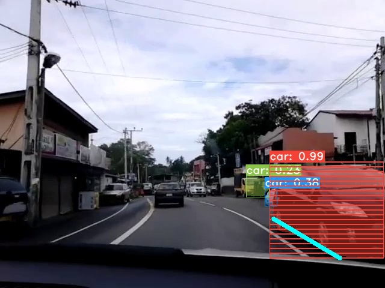

Technologies used in - Machine Learning, Image Processing, Neural Networks

# FYP (Final Year Projet)

This is a Driver Assistance System you can use in your Vehicle with a mono dash camera. 

step 1 - Clone this repository 

step 2 - download yolov3.weights file from here and put it inside the weights file. (we used the thir oned(YOLOv3-608))

|Model| Train| Test| mAP| FLOPS| Weights|
|:------------------------:|:------------------------:|:------------------------:|:------------------------:|:------------------------:|:------------------------:|
|YOLOv3-320	|COCO trainval|test-dev	|51.5|38.97 Bn|[weights](https://pjreddie.com/media/files/yolov3.weights)| 	
|YOLOv3-416|COCO trainval|test-dev |55.3|65.86 Bn|[weights](https://pjreddie.com/media/files/yolov3.weights)| 	
|YOLOv3-608|COCO trainval|test-dev |57.9|140.69 Bn|[weights](https://pjreddie.com/media/files/yolov3.weights)| 	
|YOLOv3-tiny|COCO trainval|test-dev |33.1|5.56 Bn|[weights](https://pjreddie.com/media/files/yolov3-tiny.weights)| 

step 3 - download yolact.pth file from here and put it inside the weights file. (we used the third one(yolact_base_54_800000.pth))

Then in the main directory you need to create a folder named "weights" and you should download the weights from the internet to this "weights" folder. 
The following links for the weights downloads have been given below.

|Image Size| Backbone| FPS| mAP| Weights|
|:------------------------:|:------------------------:|:------------------------:|:------------------------:|:------------------------:|
|550|Resnet50-FPN|42.5|28.2|[yolact_resnet50_54_800000.pth](https://drive.google.com/file/d/1yp7ZbbDwvMiFJEq4ptVKTYTI2VeRDXl0/view)| 	
|550|Darknet53-FPN|40.0|28.7|[yolact_darknet53_54_800000.pth](https://drive.google.com/file/d/1dukLrTzZQEuhzitGkHaGjphlmRJOjVnP/view?usp=sharing)| 	
|550|Resnet101-FPN|33.5|29.8|[yolact_base_54_800000.pth](https://drive.google.com/file/d/1UYy3dMapbH1BnmtZU4WH1zbYgOzzHHf_/view?usp=sharing)| 	
|700|Resnet101-FPN|23.6|31.2|[yolact_im700_54_800000.pth](https://drive.google.com/file/d/1lE4Lz5p25teiXV-6HdTiOJSnS7u7GBzg/view?usp=sharing)| 

step 4 - run the below command in the cmd to convert the yolov3.weights file into tensorflow supported weight file.
"python convert.py --weights ./weights/yolov3.weights --output ./weights/yolov3.tf"

step 5 - put your video inside the folder, "data/video".

step 6 - 
Finally you need to run - 

python object_tracker.py --video ./(Location of the input video) --output ./data/video/result.avi
eg : - python object_tracker.py --video ./data/video/001.mp4 --output ./data/video/result.avi

We get the markings of the most dangerous vehicles using ML as shown in the below image.

